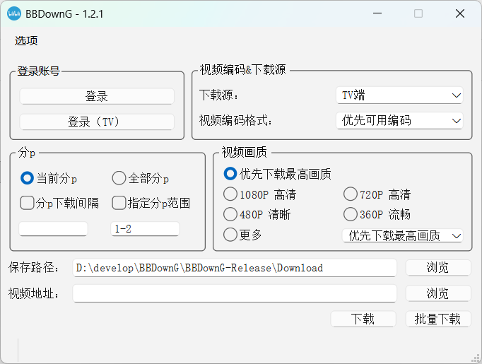
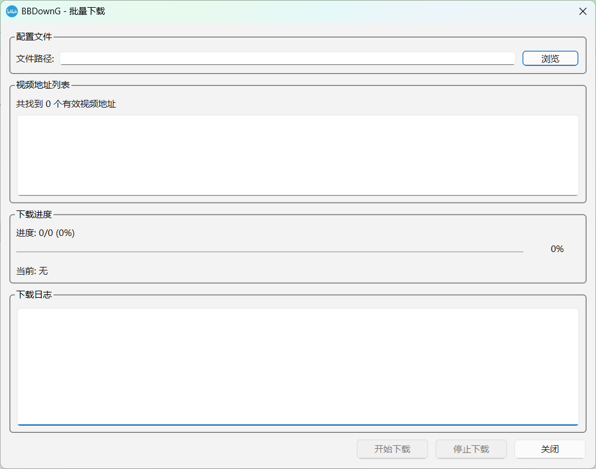

# BBDownG - 哔哩哔哩视频下载器

<div align="center">


**BBDown 的现代化图形界面版本**

[下载](https://github.com/albert-huan/BBDownG/releases) | [文档](#-使用指南) | [更新日志](CHANGELOG.md) | [问题反馈](https://github.com/albert-huan/BBDownG/issues)

</div>

---

## 📖 简介

BBDownG 是 [BBDown](https://github.com/nilaoda/BBDown) 的图形化跨平台版本，为 B 站视频下载提供直观易用的图形界面。支持视频、音频、字幕、弹幕等多种内容下载，功能强大，操作简单。



### ✨ 主要特性

- 🎨 **现代化界面** - 简洁直观的图形界面，操作便捷
- 🔐 **登录支持** - 扫码登录，下载高画质视频（4K/8K）
- 📦 **批量下载** - 支持从文本文件批量下载多个视频
- ⚙️ **完整功能** - 完全兼容 BBDown 最新版本的所有功能
- 🚀 **自动配置** - 首次运行自动配置工具路径

---

## 🚀 快速开始

### 下载安装

1. **下载发布包**
   - 访问 [Releases](https://github.com/albert-huan/BBDownG/releases/latest) 页面
   - 下载 `BBDownG-v1.2.1-Windows-x64.7z`
   - 解压到任意目录

2. **运行程序**
   - 双击 `BBDownG.exe` 启动程序
   - 首次运行会自动配置工具路径

### 基本使用

1. **登录账号（推荐）**
   ```
   点击"登录"按钮 → 扫描二维码 → 登录成功
   ```
   登录后可下载更高画质（需要大会员）

2. **下载视频**
   ```
   输入视频链接 → 选择画质 → 点击"下载"
   ```

3. **批量下载**
   ```
   创建文本文件 → 每行一个链接 → 选择文件 → 开始下载
   ```

---

## 📚 使用指南

### 登录功能

支持两种登录方式：

- **普通登录** - 用于下载普通视频
- **TV 登录** - 用于下载 TV 端独占内容

登录成功后，状态栏会显示用户名，如：`✓ ASASRCoder | ✓ TV`

### 画质选择

- **优先下载最高画质** - 自动选择最高可用画质
- **1080P 高清** - 适合大多数场景
- **720P 高清** - 节省空间
- **480P/360P** - 快速下载

> 💡 提示：登录后可下载更高画质（4K、8K 等，需要大会员）

### 批量下载

#### 创建配置文件

**TXT 格式** (推荐)
```txt
# 注释行以 # 开头
https://www.bilibili.com/video/BV1xx411c7mu
https://www.bilibili.com/video/BV1GJ411x7h7
BV1234567890
```

**INI 格式**
```ini
[视频列表]
video1 = https://www.bilibili.com/video/BV1xx411c7mu
video2 = BV1GJ411x7h7
```

#### 支持的 URL 格式

- 完整链接：`https://www.bilibili.com/video/BV1xx411c7mu`
- 短链接：`https://b23.tv/BV1xx411c7mu`
- BV 号：`BV1xx411c7mu`
- 番剧：`ep123456` 或 `ss12345`

### 高级设置

在"设置"菜单中可以配置：

- **BBDown 路径** - 下载核心程序
- **FFmpeg 路径** - 视频处理工具
- **aria2c 路径** - 多线程下载工具
- **下载选项** - 音频、视频、字幕、弹幕等
- **代理设置** - 网络代理配置

---

## 🛠️ 从源码运行

### 环境要求

- Python 3.7+
- PySide6 6.9.2+
- PyInstaller 6.15.0+（打包用）

### 安装依赖

```bash
# 克隆仓库
git clone https://github.com/albert-huan/BBDownG.git
cd BBDownG

# 安装依赖
pip install -r requirements.txt
```

### 运行程序

```bash
python main.py
```

### 打包为 exe

```bash
# 最小化版本（推荐，约 50MB）
python build_exe_minimal.py
```

---

## 📦 发布包内容

```
BBDownG-Release/
├── BBDownG.exe          # 主程序（约 50MB）
├── BBDown.exe           # 下载核心
├── ffmpeg/              # 视频处理工具
│   └── bin/
│       └── ffmpeg.exe
├── aria2/               # 下载加速工具
│   └── aria2c.exe
├── 使用说明.txt         # 详细说明
└── README.txt           # 快速指南
```

## 🎯 功能特性

### 下载功能

- ✅ 视频下载（支持 4K/8K）
- ✅ 音频下载
- ✅ 字幕下载
- ✅ 弹幕下载（支持多种格式）
- ✅ 封面下载
- ✅ 批量下载
- ✅ 断点续传

### 画质支持

- 8K 超高清（需要大会员）
- 4K 超清（需要大会员）
- 1080P 60帧（需要大会员）
- 1080P 高清
- 720P 高清
- 480P 清晰
- 360P 流畅

### 高级功能

- 🔐 账号登录（扫码）
- 📊 实时下载进度
- 🎨 自定义文件名
- 🌐 代理支持
- 🚀 多线程下载
- 📝 下载记录

---

## 🔧 常见问题

### Q: 下载速度慢怎么办？

**A**: 
1. 在设置中启用"使用 aria2c"
2. 启用"使用多线程下载"
3. 检查网络连接

### Q: 无法下载高画质？

**A**: 
1. 确保已登录账号
2. 检查是否有大会员
3. 某些视频需要特定权限

### Q: 下载的视频没有声音？

**A**: 确保已正确配置 FFmpeg 路径，用于合并音视频

### Q: 提示"未找到 BBDown"？

**A**: 在设置中手动指定 BBDown.exe 的路径

### Q: 中文显示乱码？

**A**: v1.2.1 已修复此问题，请更新到最新版本

---

## 🤝 贡献

欢迎提交 Issue 和 Pull Request！

### 开发指南

1. Fork 本仓库
2. 创建特性分支 (`git checkout -b feature/AmazingFeature`)
3. 提交更改 (`git commit -m 'Add some AmazingFeature'`)
4. 推送到分支 (`git push origin feature/AmazingFeature`)
5. 开启 Pull Request

---

## 📄 许可证

本项目遵循相关开源项目的许可协议。

**免责声明**: 本软件仅供学习交流使用，请勿用于商业用途或侵犯版权。

---

## 🙏 致谢

感谢以下开源项目和开发者：

- **[BBDown](https://github.com/nilaoda/BBDown)** - 核心下载引擎
- **[BBDown-GUI](https://github.com/1299172402/BBDown_GUI)** - UI 设计参考
- **[BBDownG 原项目](https://github.com/7lumen/BBDownG)** - 项目基础
- **[PySide6](https://www.qt.io/qt-for-python)** - GUI 框架
- **[PyInstaller](https://www.pyinstaller.org/)** - 打包工具
- **[FFmpeg](https://ffmpeg.org/)** - 媒体处理
- **[aria2](https://aria2.github.io/)** - 下载工具

---

## ⭐ Star History

如果这个项目对你有帮助，请给个 Star ⭐

---
